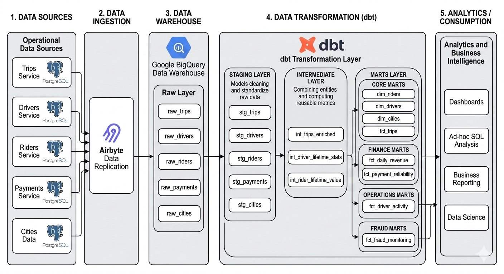
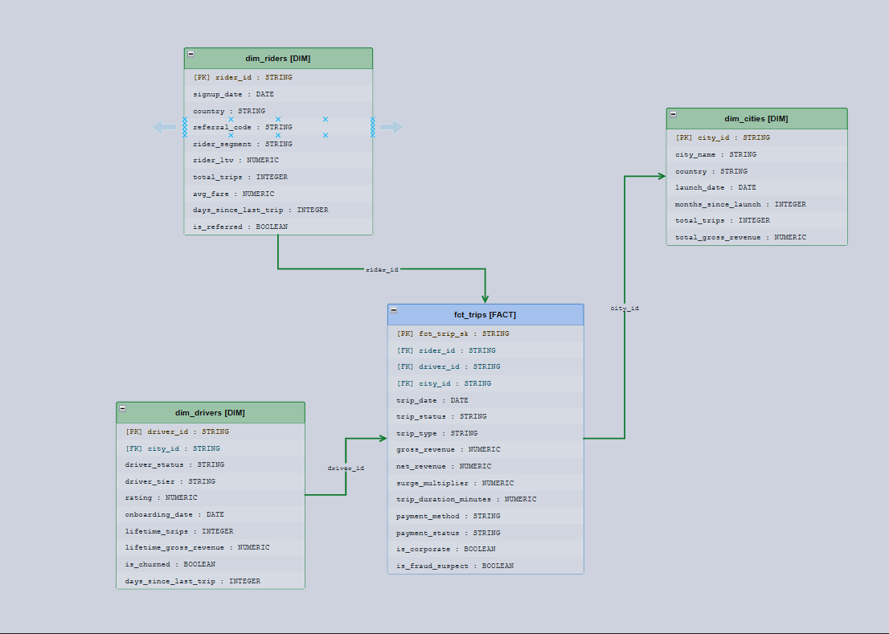

# Beejan Ride Analytics --- dbt Data Warehouse Project

## Overview

This project models analytics data for a ride‑hailing platform similar
to Uber.\
The goal is to transform raw operational data into a clean,
analytics‑ready warehouse using **dbt** and **BigQuery**.

The warehouse supports analysis across: - Trip activity - Rider behavior
and lifetime value - Driver performance - Revenue trends - Fraud signals

The project follows a layered **analytics engineering architecture** to
ensure the data is reliable, modular, and easy to extend.

---

## Stack

| Tool       | Role                                                              |
| ---------- | ----------------------------------------------------------------- |
| PostgreSQL | Transactional source                                              |
| Airbyte    | Ingestion (CDC for trips/events, full-refresh for drivers/riders) |
| BigQuery   | Cloud warehouse                                                   |
| dbt Core   | Transformation layer                                              |

---

## Architecture



The pipeline follows a four-layer pattern:

```
PostgreSQL → [Airbyte] → raw → staging → intermediate → marts
```

**raw** — untouched source tables. Airbyte writes here, nothing else does.

**staging** — one model per source table. Deduplicates, casts types, renames columns, drops null PKs. Everything is a view except `stg_driver_status_events`, which is incremental (it's a high-volume event table — full scans would be expensive).

**intermediate** — business logic lives here. Joins, derived metrics, fraud flags, LTV calculations. `int_trips_enriched` is materialised as a table because four downstream models reference it. The other two are views. Nothing in this layer is meant to be queried directly.

**marts** — uses star schema. Fact tables for trips and dimension tables for drivers, riders and cities. Incremental fact tables are partitioned by date.

---

## ERD




---

## Data flow

```
1.  Airbyte syncs every 2 hours
      trips, payments        → CDC (low latency, captures updates)
      drivers, riders        → full refresh (small tables, need latest state)
      driver_status_events   → append-only CDC (very high volume)

2.  dbt runs after each sync
      dbt source freshness   → alerts if raw data is stale
      dbt build              → models + tests in DAG order
      dbt snapshot           → daily, tracks driver SCD2 history

3.  Docs refresh
      dbt docs generate      → updates lineage graph + column docs
```

Freshness thresholds: trips/payments error after 2 hours. Status events error after 3 hours.

---

## Models

### Staging

| Model                    | Materialization |
| ------------------------ | --------------- | --- |
| stg_trips                | view            |     |
| stg_drivers              | view            |
| stg_riders               | view            |
| stg_payments             | view            |
| stg_cities               | view            |
| stg_driver_status_events | incremental     |

### Intermediate

| Model                     | Materialization | Why                                    |
| ------------------------- | --------------- | -------------------------------------- |
| int_trips_enriched        | table           | Referenced by 4+ marts — computes once |
| int_driver_lifetime_stats | view            | Single consumer                        |
| int_rider_lifetime_value  | view            | Single consumer                        |

### Marts

| Model        | Schema | Materialization |
| ------------ | ------ | --------------- |
| fct_trips    | core   | incremental     |
| dim_drivers  | core   | table           |
| dim_riders   | core   | table           |
| dim_cities   | core   | table           |
| dim_vehicles | core   | table           |
| dim_date     | core   | table           |

### Snapshot

`drivers_snapshot` — SCD Type 2. Tracks `driver_status`, `vehicle_id`, and `rating` changes with full history via `dbt_valid_from / dbt_valid_to`.

---

## Incremental strategy

All high-volume fact tables use `insert_overwrite` on date partitions with a 1-day lookback window to catch late-arriving records.

**Why not full refresh every time?**

Full refresh re-scans the entire trip history on every run. At scale that's slow and expensive. Incremental keeps run time flat as data grows which means you're only processing new partitions.

**The tradeoff is complexity.** Schema changes require a manual `--full-refresh`. Late data beyond the 1-day lookback window gets missed without intervention. A weekly scheduled full refresh handles both.

---

## Data quality

Tests are defined in YAML across all layers.

**Generic tests** — `not_null`, `unique`, `relationships`, `accepted_values` on all primary keys, foreign keys, and enum columns.

**Custom tests:**

| Test                                | Checks                                      |
| ----------------------------------- | ------------------------------------------- |
| `assert_no_negative_revenue`        | gross_revenue, net_revenue ≥ 0              |
| `assert_positive_trip_duration`     | completed trips have duration > 0           |
| `assert_completed_trip_has_payment` | completed trips have ≥ 1 successful payment |

**Source freshness** — configured per table.

---

## Macros

| Macro                               | What it does                                  |
| ----------------------------------- | --------------------------------------------- |
| `calc_net_revenue(fare, fee)`       | Deducts platform cut (20%) and processing fee |
| `calc_duration_minutes(start, end)` | Safe timestamp diff, returns NULL if ≤ 0      |
| `safe_divide(num, denom)`           | NULL instead of divide-by-zero                |
| `generate_surrogate_key_from_cols`  | Thin wrapper on dbt_utils surrogate key       |

---

## Running it

```bash
# Install
pip install dbt-bigquery
dbt deps

# Configure
cp profiles.yml ~/.dbt/profiles.yml
# edit with your GCP project details

# Run
dbt source freshness        # check raw data is fresh
dbt build                   # models + tests
dbt snapshot                # SCD2 history
dbt docs generate && dbt docs serve   # lineage + docs
```

For incremental models after a logic change:

```bash
dbt build --full-refresh --select fct_trips+
```

---

## Sample queries

All queries are in `analyses/sample_analytical_queries.sql`. They cover:

1. Daily revenue by city
2. Gross vs net — corporate vs personal
3. Top 10 drivers by revenue
4. Rider LTV by segment
5. Payment failure rate by provider
6. Surge impact analysis
7. Driver churn by city and tier
8. Fraud suspect trips
9. City profitability overview
10. Driver history via SCD2 snapshot

---

## Design decisions

### Layered dbt Architecture

The project separates transformations into staging, intermediate, and
marts layers to improve maintainability and reusability.

### Enriched Trip Model

Trips are enriched with rider, driver, payment, and city data to provide
a single comprehensive dataset used across multiple marts. Originally ephemeral but it's referenced by too many downstream models. Keeping it ephemeral means the enrichment SQL re-executes four times per run. Materialising it as a table computes once and saves meaningful cost at scale.

### Snapshot for Driver History

A dbt snapshot tracks historical driver changes such as rating updates
and status transitions.

### Metrics in Intermediate Layer

Key metrics such as net revenue and trip duration are calculated once
and reused downstream.

### Insert_overwrite over merge

BigQuery's `MERGE` is more expensive than partition overwrite for append-heavy tables. Reprocessing the last 1–2 partitions handles late data at lower cost.

---

# Tradeoffs

Some design decisions were made to balance simplicity and analytical
depth.

- **Payment details were partially aggregated into the trip model** to
  simplify analysis.
- This approach reduces model complexity but hides some retry‑level
  payment behavior.
- In a full production system, a separate **`fct_payments` fact
  table** would likely exist.

---

## What's missing / next steps

- **`dim_vehicles` source table** — `vehicles_raw` with make, model, fuel type, capacity would unlock fleet analytics properly
- **Multi-currency normalisation** — all revenue is in local currency; a GBP exchange rate seed is needed for cross-city comparisons
- **dbt Semantic Layer** — define `revenue`, `ltv`, `churn_rate` as official metrics so BI tools query consistent definitions
- **Streaming for status events** — move `driver_status_events` to Pub/Sub → BigQuery streaming for sub-minute driver monitoring
- **ML feature tables** — `int_rider_lifetime_value` and `int_driver_lifetime_stats` are ready to serve as feature store inputs for churn prediction
- Introduce a dedicated **payment fact table**
- Implement **incremental models** for very large datasets
- Build **semantic metrics layer**
- Create BI dashboards for driver performance and revenue monitoring

---

## dbt Lineage

The lineage graph below shows how models depend on each other.


To generate the lineage graph:

Run `dbt docs generate && dbt docs serve` to open the interactive lineage graph.

# Author

Eyitoyosi Alabi\
Data / Analytics Engineer
*data-engineering@beejanride.com*
